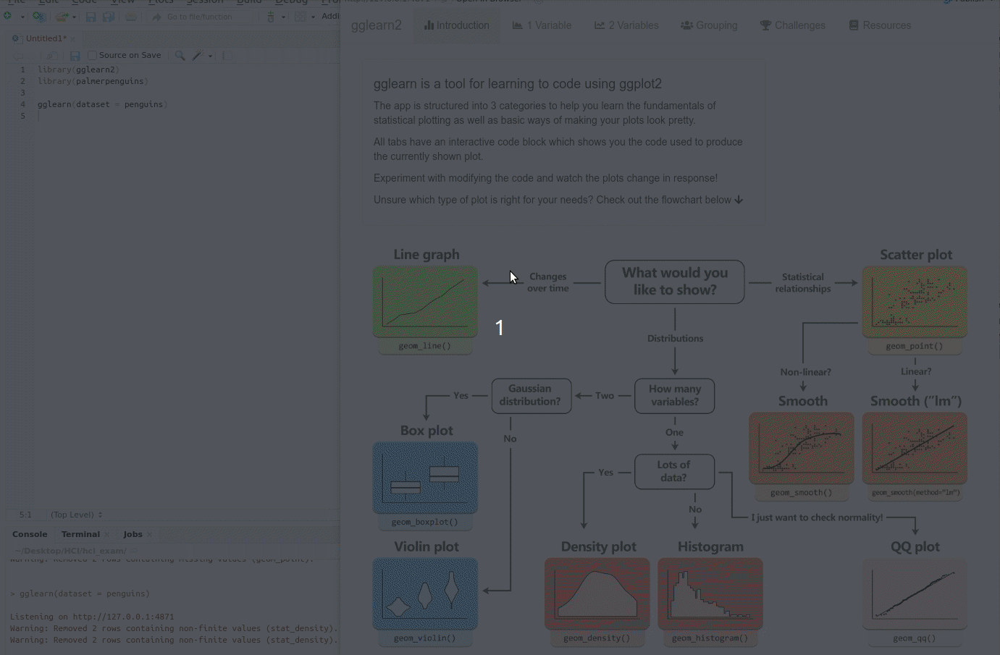

# gglearn2
An interactive learning environment for ggplot 2 using Shiny R.

Online demo with read-only code block available [here](https://hlasse.shinyapps.io/gglearn2/)

### Installation

```r
devtools::install_github("HLasse/gglearn2")
```

### Usage
To start the Shiny app with your desired dataframe (df), simply run:

```r
gglearn(dataset = df)
```

### GIF demonstration



Please submit any problems or suggestions for future developments in _Issues_


----

Created by [Lasse Hansen](https://github.com/HLasse/) and [Kenneth C. Enevoldsen](https://github.com/kennethenevoldsen/) for an exam in Human Computer Interaction at Aarhus University.
